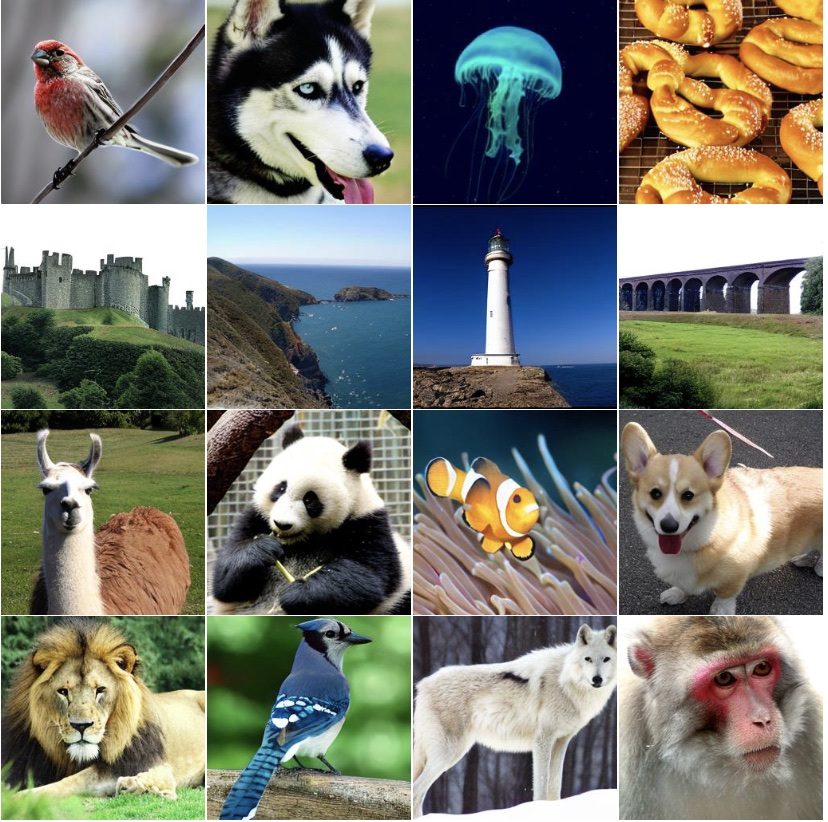

# Masked Diffusion Transformer
	
[](https://paperswithcode.com/sota/image-generation-on-imagenet-256x256?p=masked-diffusion-transformer-is-a-strong)

The official codebase for [Masked Diffusion Transformer is a Strong Image Synthesizer](https://arxiv.org/abs/2303.14389).

## Introduction

Despite its success in image synthesis, we observe that diffusion probabilistic models (DPMs) often lack contextual reasoning ability to learn the relations among object parts in an image, leading to a slow learning process. 

To solve this issue, we propose a Masked Diffusion Transformer (MDT) that introduces a mask latent modeling scheme to explicitly enhance the DPMs’ ability of contextual relation learning among object semantic parts in an image. During training, MDT operates on the latent space to mask certain tokens. Then, an asymmetric masking diffusion transformer is designed to predict masked tokens from unmasked ones while maintaining the diffusion generation process. Our MDT can reconstruct the full information of an image from its incomplete contextual input, thus enabling it to learn the associated relations among image tokens. 

Experimental results show that MDT achieves superior image synthesis performance, e.g. a new SoTA FID score on the ImageNet dataset, and has about 3× faster learning speed than the previous SoTA DiT.



# Performance

| Model| Dataset |  Resolution | FID-50K | Inception Score |
|---------|----------|-----------|---------|--------|
|MDT-XL/2 | ImageNet | 256x256   | 1.79    | 283.01|

**NEW SOTA on FID.**
# Setup

Prepare the Pytorch 1.13 version. Download and install this repo.

```
git clone https://github.com/sail-sg/MDT
cd MDT
pip install -e .
```

# Training

<details>
  <summary>Training on one node (`run.sh`). </summary>

```shell
export OPENAI_LOGDIR=output_mdt_s2
NUM_GPUS=8

MODEL_FLAGS="--image_size 256 --mask_ratio 0.30 --decode_layer 2 --model MDT_S_2"
DIFFUSION_FLAGS="--diffusion_steps 1000"
TRAIN_FLAGS="--batch_size 32"
DATA_PATH=/dataset/imagenet

python -m torch.distributed.launch --nproc_per_node=$NUM_GPUS scripts/image_train.py --data_dir $DATA_PATH $MODEL_FLAGS $DIFFUSION_FLAGS $TRAIN_FLAGS
```

</details>

<details>
  <summary>Training on multiple nodes (`run_ddp_master.sh` and `run_ddp_worker.sh`). </summary>

```shell
# On master:
export OPENAI_LOGDIR=output_mdt_xl2
MODEL_FLAGS="--image_size 256 --mask_ratio 0.30 --decode_layer 2 --model MDT_XL_2"
DIFFUSION_FLAGS="--diffusion_steps 1000"
TRAIN_FLAGS="--batch_size 4"
DATA_PATH=/dataset/imagenet
NUM_NODE=8
GPU_PRE_NODE=8

python -m torch.distributed.launch --master_addr=$(hostname) --nnodes=$NUM_NODE --node_rank=$RANK --nproc_per_node=$GPU_PRE_NODE --master_port=$MASTER_PORT scripts/image_train.py --data_dir $DATA_PATH $MODEL_FLAGS $DIFFUSION_FLAGS $TRAIN_FLAGS

# On workers:
export OPENAI_LOGDIR=output_mdt_xl2
MODEL_FLAGS="--image_size 256 --mask_ratio 0.30 --decode_layer 2 --model MDT_XL_2"
DIFFUSION_FLAGS="--diffusion_steps 1000"
TRAIN_FLAGS="--batch_size 4"
DATA_PATH=/dataset/imagenet
NUM_NODE=8
GPU_PRE_NODE=8

python -m torch.distributed.launch --master_addr=$MASTER_ADDR --nnodes=$NUM_NODE --node_rank=$RANK --nproc_per_node=$GPU_PRE_NODE --master_port=$MASTER_PORT scripts/image_train.py --data_dir $DATA_PATH $MODEL_FLAGS $DIFFUSION_FLAGS $TRAIN_FLAGS


```

</details>

# Evaluation

The evaluation code is obtained from [ADM's TensorFlow evaluation suite](https://github.com/openai/guided-diffusion/tree/main/evaluations).
Please follow the instructions in the `evaluations` folder to set up the evaluation environment.

<details>
  <summary>Sampling and Evaluation (`run_sample.sh`): </summary>

```shell
MODEL_PATH=output_mdt_xl2/mdt_xl2_v1_ckpt.pt
export OPENAI_LOGDIR=output_mdt_xl2_eval
NUM_GPUS=8

echo 'CFG Class-conditional sampling:'
MODEL_FLAGS="--image_size 256 --model MDT_XL_2 --decode_layer 2"
DIFFUSION_FLAGS="--num_sampling_steps 250 --num_samples 50000  --cfg_cond True"
echo $MODEL_FLAGS
echo $DIFFUSION_FLAGS
echo $MODEL_PATH
python -m torch.distributed.launch --nproc_per_node=$NUM_GPUS scripts/image_sample.py --model_path $MODEL_PATH $MODEL_FLAGS $DIFFUSION_FLAGS
echo $MODEL_FLAGS
echo $DIFFUSION_FLAGS
echo $MODEL_PATH
python evaluations/evaluator.py ../dataeval/VIRTUAL_imagenet256_labeled.npz $OPENAI_LOGDIR/samples_50000x256x256x3.npz

echo 'Class-conditional sampling:'
MODEL_FLAGS="--image_size 256 --model MDT_XL_2 --decode_layer 2"
DIFFUSION_FLAGS="--num_sampling_steps 250 --num_samples 50000"
echo $MODEL_FLAGS
echo $DIFFUSION_FLAGS
echo $MODEL_PATH
python -m torch.distributed.launch --nproc_per_node=$NUM_GPUS scripts/image_sample.py --model_path $MODEL_PATH $MODEL_FLAGS $DIFFUSION_FLAGS
echo $MODEL_FLAGS
echo $DIFFUSION_FLAGS
echo $MODEL_PATH
python evaluations/evaluator.py ../dataeval/VIRTUAL_imagenet256_labeled.npz $OPENAI_LOGDIR/samples_50000x256x256x3.npz
```

</details>

# Visualization

Run the `infer_mdt.py` to generate images.

# Citation

```
@misc{gao2023masked,
      title={Masked Diffusion Transformer is a Strong Image Synthesizer}, 
      author={Shanghua Gao and Pan Zhou and Ming-Ming Cheng and Shuicheng Yan},
      year={2023},
      eprint={2303.14389},
      archivePrefix={arXiv},
      primaryClass={cs.CV}
}
```

# Acknowledgement

This codebase is built based on the [DiT](https://github.com/facebookresearch/dit) and [ADM](https://github.com/openai/guided-diffusion). Thanks!
